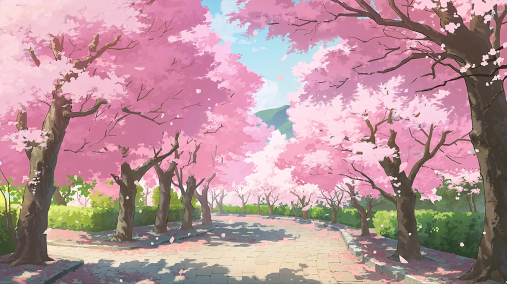
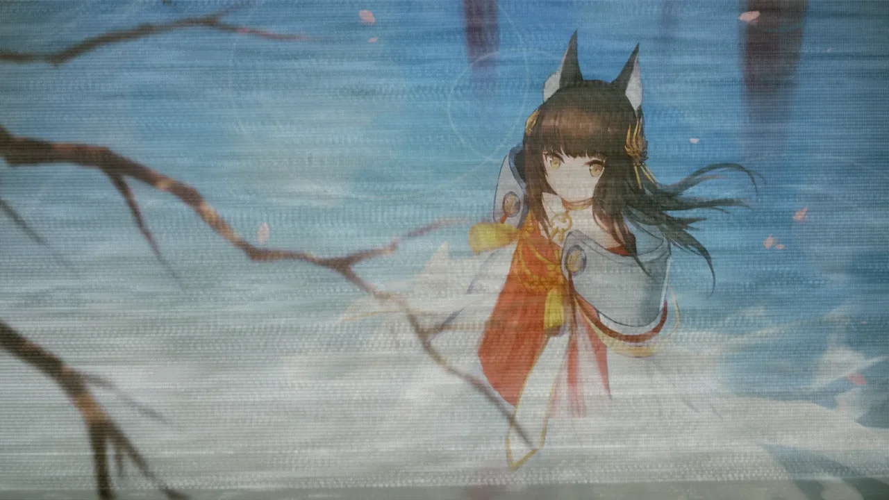

 <!-- начало главы -->

Игра теней в листве








 <!-- конец главы -->

 <!-- начало главы -->

Предзнаменование сна





 <!-- конец главы -->

 <!-- начало главы -->

Отправление




 <!-- конец главы -->

 <!-- начало главы -->

Воспоминания под луной





 <!-- конец главы -->

 <!-- начало главы -->

Встреча среди сакуры








 <!-- конец главы -->

 <!-- начало главы -->

Раскат грома




 <!-- конец главы -->

 <!-- начало главы -->

Долгая бессонная ночь














 <!-- конец главы -->